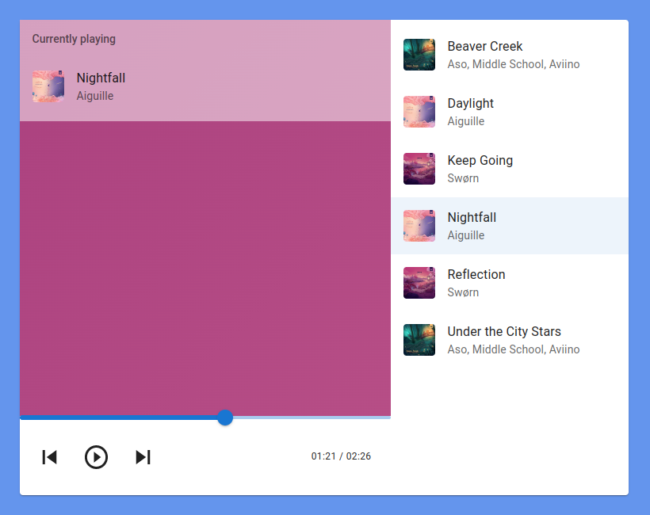
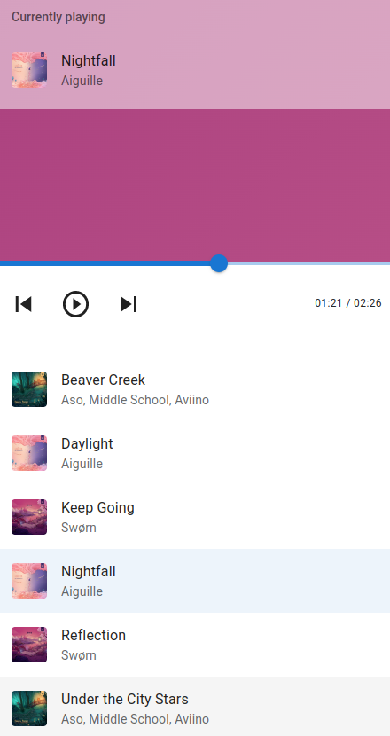

# React music app

Live demo: http://othe.rs/music-player/

Before starting, make sure to have NodeJS and NPM installed. Install all dependencies and start the app by executing:

```shell
npm install
npm start
```

Then, open the `http://localhost:3000/` address in browser.

Enjoy.

## Desktop


## Mobile

